# UniBook Admin Dashboard

A comprehensive admin dashboard for managing university resource bookings. Built with React, Vite, and Supabase, this application provides administrators with powerful tools to manage resources, bookings, users, and system settings.

## 🚀 Features

### 📊 Dashboard

- **Real-time Statistics**: View booking statistics, revenue metrics, and resource utilization
- **Activity Monitoring**: Track today's check-ins and check-outs
- **Analytics Charts**: Visualize booking duration patterns and sales trends
- **Quick Actions**: Access frequently used functions from the dashboard

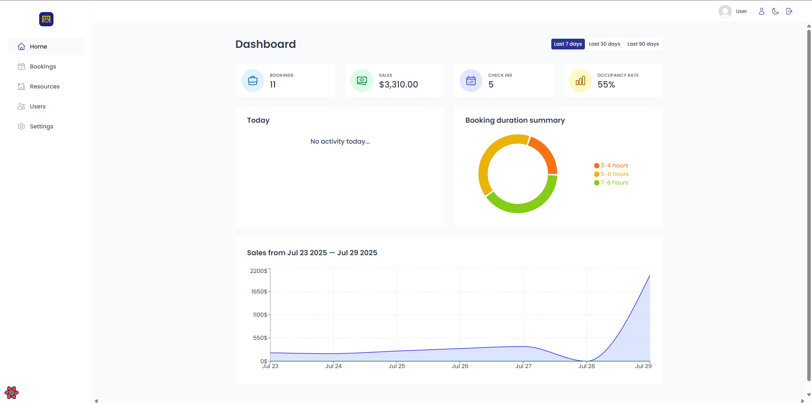
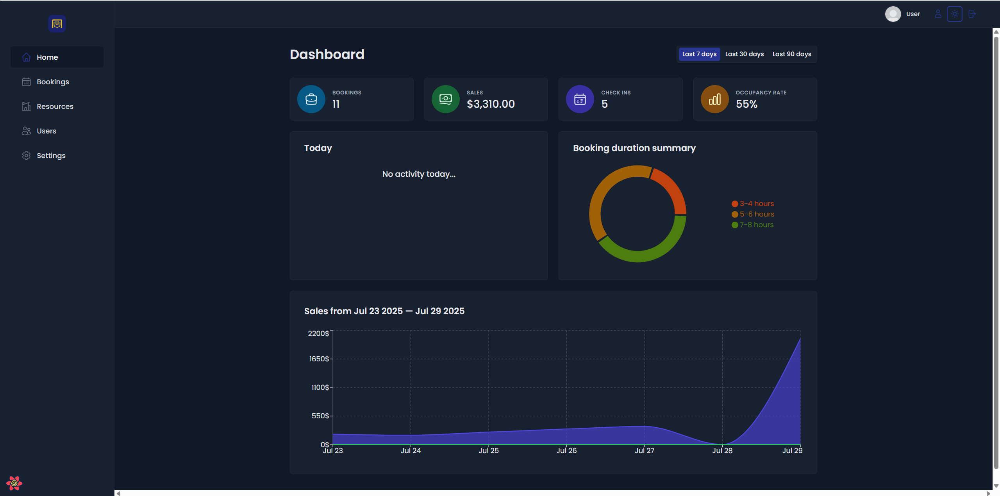

### 🏢 Resource Management

- **Resource CRUD**: Create, read, update, and delete university resources
- **Capacity Management**: Set and manage resource capacity limits
- **Pricing Control**: Configure pricing and discount options
- **Image Management**: Upload and manage resource images
- **Filtering & Sorting**: Advanced filtering and sorting capabilities

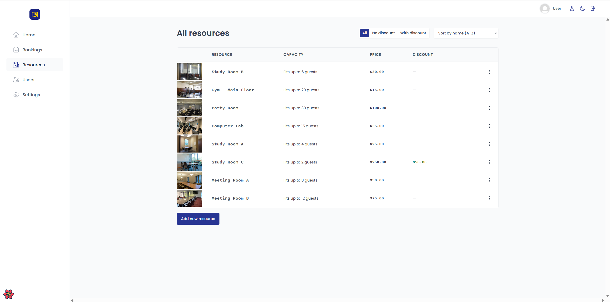
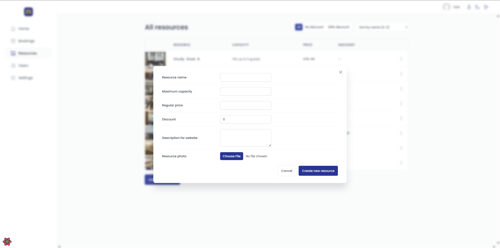
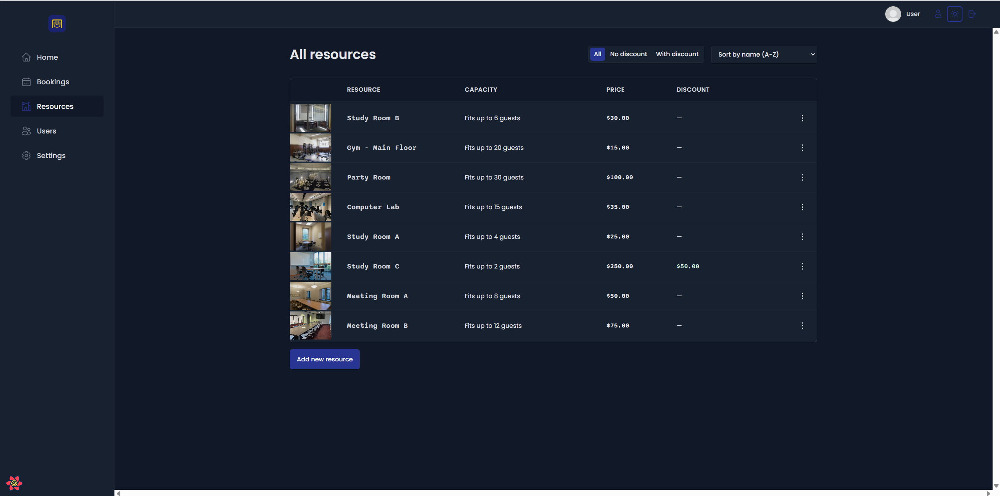

### 📅 Booking Management

- **Booking Overview**: Comprehensive view of all bookings
- **Status Tracking**: Monitor booking status (unconfirmed, checked-in, checked-out)
- **Guest Information**: View detailed guest and booking information
- **Pagination**: Handle large volumes of bookings efficiently
- **Search & Filter**: Advanced search and filtering options

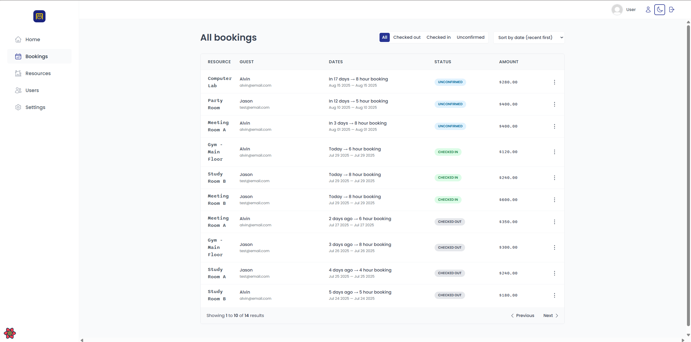
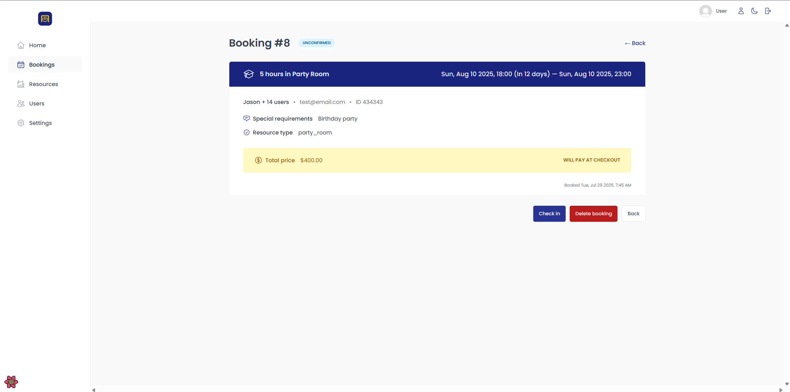
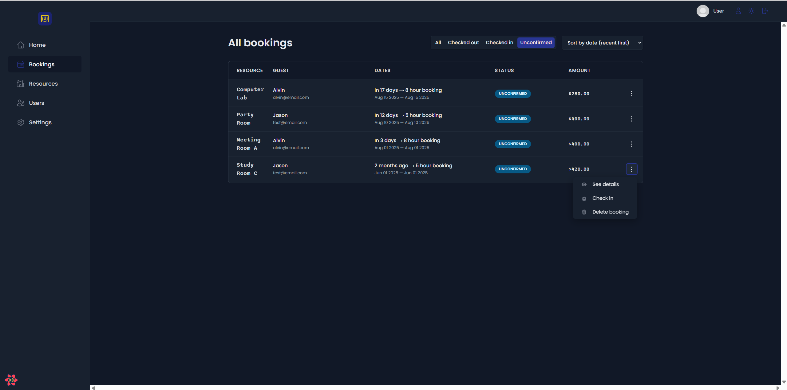

### 👥 User Management

- **User Profiles**: Manage user accounts and profiles
- **Authentication**: Secure login and logout functionality
- **Role Management**: Control access based on user roles
- **Account Settings**: User profile and password management

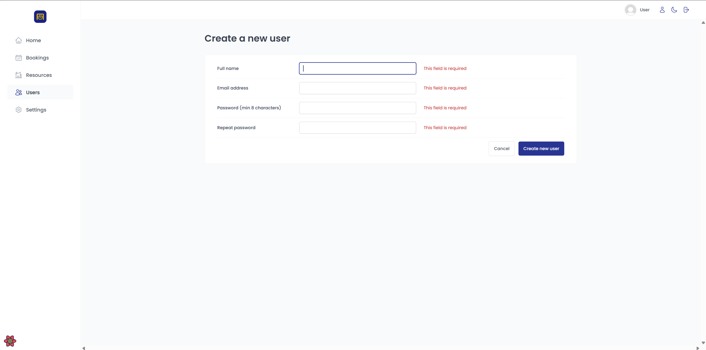

### ⚙️ System Settings

- **Booking Rules**: Configure minimum/maximum booking hours
- **Guest Limits**: Set maximum guests per booking
- **Advance Booking**: Configure how far in advance users can book
- **System Preferences**: Manage global system settings

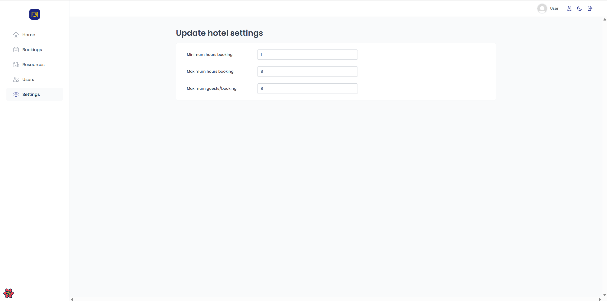

### 🔐 Authentication & Security

- **Protected Routes**: Secure access to admin features
- **Session Management**: Automatic session handling
- **Dark Mode**: Toggle between light and dark themes
- **Responsive Design**: Works seamlessly on all devices

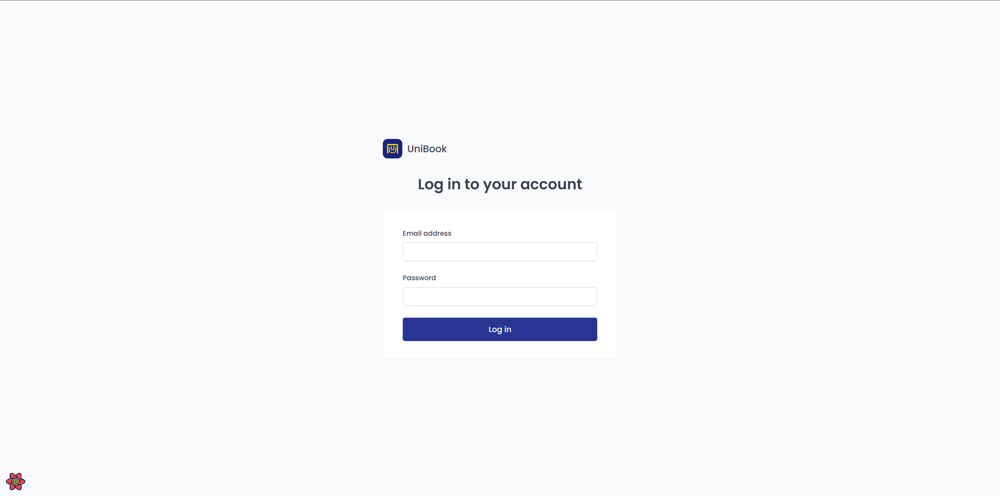

## 🛠️ Tech Stack

- **Frontend**: React 18 with Vite
- **Styling**: Styled Components
- **State Management**: React Query (TanStack Query)
- **Routing**: React Router DOM
- **Forms**: React Hook Form
- **Notifications**: React Hot Toast
- **Charts**: Recharts
- **Icons**: React Icons
- **Backend**: Supabase (PostgreSQL + Auth)
- **Deployment**: Netlify

## 📦 Installation

### Prerequisites

- Node.js (v16 or higher)
- npm or yarn
- Supabase account and project

### Setup Instructions

1. **Clone the repository**

   ```bash
   git clone <repository-url>
   cd unibook-admin
   ```

2. **Install dependencies**

   ```bash
   npm install
   ```

3. **Configure Supabase**

   - Create a new Supabase project
   - Set up your database tables (see Database Schema section)
   - Update the Supabase configuration in `src/services/supabase.js`

4. **Start the development server**

   ```bash
   npm run dev
   ```

5. **Open your browser**
   Navigate to `http://localhost:5173`

## 🗄️ Database Schema

The application uses the following main tables:

### Resources Table

```sql
CREATE TABLE resources (
  id SERIAL PRIMARY KEY,
  name VARCHAR NOT NULL,
  maxCapacity INTEGER NOT NULL,
  regularPrice DECIMAL NOT NULL,
  discount INTEGER DEFAULT 0,
  description TEXT,
  image VARCHAR,
  created_at TIMESTAMP DEFAULT NOW()
);
```

### Bookings Table

```sql
CREATE TABLE bookings (
  id SERIAL PRIMARY KEY,
  created_at TIMESTAMP DEFAULT NOW(),
  startDate TIMESTAMP NOT NULL,
  endDate TIMESTAMP NOT NULL,
  numHours INTEGER NOT NULL,
  numGuests INTEGER NOT NULL,
  resourcePrice DECIMAL NOT NULL,
  totalPrice DECIMAL NOT NULL,
  status VARCHAR DEFAULT 'unconfirmed',
  observations TEXT,
  resourceId INTEGER REFERENCES resources(id),
  guestId INTEGER REFERENCES guests(id)
);
```

### Settings Table

```sql
CREATE TABLE settings (
  id SERIAL PRIMARY KEY,
  minBookingHours INTEGER DEFAULT 1,
  maxBookingHours INTEGER DEFAULT 8,
  maxGuestsPerBooking INTEGER DEFAULT 10,
  maxAdvanceBookingDays INTEGER DEFAULT 30
);
```

## 🚀 Deployment

### Netlify Deployment

The project is configured for Netlify deployment with the following settings:

1. **Build Command**: `npm run build`
2. **Publish Directory**: `dist`
3. **Environment Variables**: Set your Supabase URL and API key

### Environment Variables

Create a `.env` file in the root directory:

```env
VITE_SUPABASE_URL=your_supabase_url
VITE_SUPABASE_ANON_KEY=your_supabase_anon_key
```

## 📁 Project Structure

```
src/
├── components/
│   ├── features/
│   │   ├── authentication/     # Login, signup, user management
│   │   ├── bookings/          # Booking management
│   │   ├── check-in-out/      # Check-in/out functionality
│   │   ├── dashboard/         # Dashboard components
│   │   ├── resources/         # Resource management
│   │   └── settings/          # System settings
│   ├── hooks/                 # Custom React hooks
│   ├── pages/                 # Page components
│   ├── services/              # API services
│   ├── styles/                # Global styles
│   ├── ui/                    # Reusable UI components
│   └── utils/                 # Utility functions
```

## 🔧 Available Scripts

- `npm run dev` - Start development server
- `npm run build` - Build for production
- `npm run preview` - Preview production build
- `npm run lint` - Run ESLint

## 🎨 Customization

### Styling

The application uses Styled Components for styling. Global styles are defined in `src/styles/GlobalStyles.js`.

### Theme

Dark mode support is built-in and can be toggled using the theme switcher in the header.

### Components

All UI components are located in `src/ui/` and can be customized as needed.

## 🤝 Contributing

1. Fork the repository
2. Create a feature branch (`git checkout -b feature/amazing-feature`)
3. Commit your changes (`git commit -m 'Add some amazing feature'`)
4. Push to the branch (`git push origin feature/amazing-feature`)
5. Open a Pull Request

## 📝 License

This project is licensed under the MIT License - see the LICENSE file for details.

## 🆘 Support

For support and questions:

- Create an issue in the repository
- Contact the development team
- Check the documentation for common issues

## 🔄 Version History

- **v0.0.0** - Initial release with core functionality
  - Dashboard with statistics and charts
  - Resource management system
  - Booking management interface
  - User authentication
  - Settings configuration

---

**UniBook Admin Dashboard** - Empowering university administrators with efficient resource booking management.
